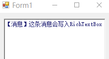
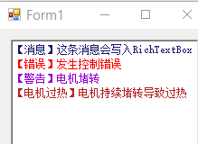
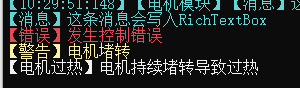

# 日志记录器

这是一个简单的日志记录器，用于.netFramework，提供记录日志的功能。

日志记录器的核心类型是Logger，其他几个类型都是他的子类，文件结构如下：


## 使用方法

日志器不提供复杂的方法，最简单的实现就是新建日志系统，并记录日志。

``` cs
static Logger log0;
static Logger log1;
//......
log0 = new LoggerToFile($"D:/SRB调试日志/log0{DateTime.Now:yyyyMMdd-HH-mm-ss}.md");
log0.LogLine($"【消息】初始完成了。");

log1 = new LoggerToConsole();
log1.LogLine($"【消息】初始完成了。");
```


## 抄送级联
如果想让一条日志输出到多个位置，可以使用Logger的抄送功能：

``` cs
log2 = new LoggerToConsole(log0);
log2.LogLine($"【消息】这条消息被log2记录后，还会抄送给log0");

log3 = new LoggerToConsole(new LoggerToFile($"D:/SRB调试日志/log3{DateTime.Now:yyyyMMdd-HH-mm-ss}.md"));
log3.LogLine($"【消息】这条消息会直接被两个日志记录器记录");
```

## 标签和时间
如果想让日志自动记录时间，可以使用TimerLogger
``` cs
log4 = new  TimerLogger(log0);
log4.LogLine($"【消息】这条消息会被加上时间标记");
`【10:21:32:956】【消息】这条消息会被加上时间标记`
```
`【10:21:32:956】【消息】这条消息会被加上时间标记`

同理，让某个模块的日志添加标签：
``` cs
log5 = new TagLogger("电机模块", log4);
log5.LogLine($"【消息】这条消息会被加上“电机模块”标签");
```
`【10:25:47:321】【电机模块】【消息】这条消息会被加上“电机模块”标签`
## 输出到文本框
首先建立Richtextbox，再初始化日志输出器：
``` cs
Program.log5 = new LoggerToRTB(this.LogTextRTB);
Program.log5.LogLine($"【消息】这条消息会写入RichTextBox");
```
<<<<<<< HEAD
=======

>>>>>>> 5fb4d6bc76cb1f148f99337a8b1148bab422ca52


## 日志显示的颜色
日志显示的颜色可以根据日志标签改变，标签文字和日志颜色的对应关系由数组控制
``` cs
Program.log6 = new LoggerToRTB(this.LogTextRTB) {
	word_color_pair = new (string word, Color color)[] {
		("【崩溃", Color.DarkRed),
		("【错误", Color.Red),
		("【警告", Color.DarkViolet),
		("【消息", Color.MidnightBlue),
		("【电机过热", Color.Firebrick),
	}
};
Program.log6.LogLine($"【消息】这条消息会写入RichTextBox");
Program.log6.LogLine($"【错误】发生控制错误");
Program.log6.LogLine($"【警告】电机堵转");
Program.log6.LogLine($"【电机过热】电机持续堵转导致过热");
```


记录到命令行的日志也有相同的颜色机制。


